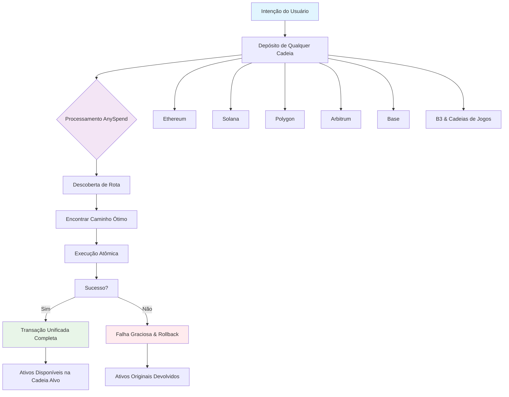

<iframe
   className="w-full aspect-video rounded-xl"
    src="https://customer-gg6qs7nm5ue94t64.cloudflarestream.com/ce7d9cc5f56abe50527c5e726017771d/iframe?muted=true&loop=true&autoplay=true&poster=https%3A%2F%2Fcustomer-gg6qs7nm5ue94t64.cloudflarestream.com%2Fce7d9cc5f56abe50527c5e726017771d%2Fthumbnails%2Fthumbnail.jpg%3Ftime%3D%26height%3D600"
    title="Fragmentação de Liquidez"
    frameBorder="0"
  allow="accelerometer; autoplay; clipboard-write; encrypted-media; gyroscope; picture-in-picture"
  allowFullScreen
  ></iframe>

<Note>
[Explore o ecossistema multichain da B3 em explorer.b3.fun](https://explorer.b3.fun/chains)
</Note>

## O Problema

Appchains, L2s e L3s possuem liquidez isolada, tornando frustrante construir experiências sem ter que transferir ativos entre cadeias.

<CardGroup cols={2}>

<Card title="Liquidez Fragmentada" icon="puzzle-piece">
  Cada cadeia mantém pools isolados, limitando a profundidade e aumentando o deslizamento.
</Card>

<Card title="Integração Complexa" icon="gears">
  Construtores devem integrar com dezenas de cadeias individualmente.
</Card>

<Card title="Experiência de Usuário Ruim" icon="face-frown">
  Usuários manualmente transferem ativos e gerenciam múltiplas carteiras.
</Card>

<Card title="Ineficiência de Capital" icon="chart-line-down">
  Ativos bloqueados em cadeias específicas não podem acessar outras oportunidades.
</Card>

</CardGroup>

## Acesso à Liquidez Entre Cadeias

Potencializado pelo nosso produto, AnySpend, opera na camada de execução do cliente, situando-se entre a intenção do usuário e a execução na blockchain:

### Como Funciona

1. **Depósito de qualquer cadeia**: Aceita tokens da maioria das cadeias
2. **Baseado em Intenção**: Usuários expressam o que querem, não como alcançá-lo
3. **Descoberta de Rota**: Encontra caminhos ótimos através de todas as cadeias suportadas
4. **Execução Atômica**: Transações são executadas atomicamente ou falham graciosamente
5. **Experiência Unificada**: Operações complexas aparecem como transações únicas

### Cadeias Suportadas

AnySpend oferece suporte universal a cadeias:

- **Cadeias EVM**: A maioria das cadeias EVM, incluindo Ethereum, Polygon, Arbitrum, Base, BSC, Avalanche
- **Solana**: Integração completa com o ecossistema Solana
- **Ecossistema B3**: Integração nativa com B3 e cadeias de jogos

## Próximos Passos

<CardGroup cols={2}>

<Card title="Experimente AnySpend" icon="rocket" href="/anyspend/introduction">
  Comece com o SDK AnySpend.
</Card>

<Card title="Guia de Integração" icon="book" href="/anyspend/installation">
  Aprenda como integrar AnySpend.
</Card>

<Card title="Referência da API" icon="code" href="/anyspend/api-reference/introduction">
  Explore a documentação completa da API.
</Card>

<Card title="Junte-se ao Discord" icon="discord" href="https://discord.gg/b3dotfun">
  Conecte-se com outros construtores.
</Card>

</CardGroup>
