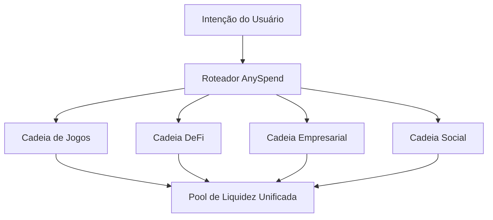

```html


<Note>
  [Explore o ecossistema multichain da B3 em explorer.b3.fun](https://explorer.b3.fun/chains)
</Note>

## A Revolução do Escalonamento

O escalonamento tradicional de blockchain focou em tornar cadeias únicas mais rápidas. A B3 adota uma abordagem diferente: **escalonamento horizontal** através de appchains construídas com propósitos específicos que trabalham juntas como um ecossistema unificado.

<CardGroup cols={2}>
  <Card title="Escalonamento Vertical" icon="arrow-up">
    Fazer uma cadeia lidar com mais transações por segundo
  </Card>
  <Card title="Escalonamento Horizontal" icon="arrow-right">
    Criar cadeias especializadas para aplicações específicas
  </Card>
</CardGroup>

## Por Que o Escalonamento Horizontal é Importante

Em vez de forçar todas as aplicações a competirem pelos mesmos recursos da blockchain, o escalonamento horizontal permite que cada app, jogo ou empresa tenha seu próprio ambiente de execução otimizado.


### A Vantagem Multi-Cadeia

<CardGroup cols={2}>
  <Card title="Otimização Específica para Aplicações" icon="gear">
    Cada appchain pode ser personalizada para seu caso de uso específico - cadeias de jogos para jogabilidade sem taxas, cadeias DeFi para negociações de alta capacidade.
  </Card>
  <Card title="Capacidade Ilimitada" icon="bolt">
    Chega de competir por espaço em blocos. Cada aplicação recebe recursos dedicados e pode escalar independentemente.
  </Card>
  <Card title="Risco Isolado" icon="shield">
    Problemas em uma appchain não afetam as outras, proporcionando melhor segurança e confiabilidade para todo o ecossistema.
  </Card>
  <Card title="Experiência Unificada" icon="link">
    Apesar de serem cadeias separadas, os usuários experimentam interações contínuas em todo o ecossistema B3.
  </Card>
</CardGroup>

## Como a B3 Habilita o Escalonamento Horizontal

### 1. Appchains Construídas com Propósitos Específicos

Cada aplicação na B3 pode implantar sua própria cadeia dedicada, otimizada para requisitos específicos:

- **Cadeias de Jogos**: Transações sem taxas, finalidade instantânea, precompilados específicos para jogos
- **Cadeias DeFi**: Negociação de alta capacidade, proteção contra MEV, primitivos financeiros
- **Cadeias Empresariais**: Recursos de privacidade, ferramentas de conformidade, governança personalizada
- **Cadeias Sociais**: Armazenamento de conteúdo, sistemas de reputação, grafos sociais

### 2. Camada de Liquidez Unificada

Enquanto as cadeias escalam horizontalmente, a liquidez permanece unificada através do [AnySpend](/protocol/liquidity):



### 3. Operações Cross-Chain Sem Costura

<Steps>
  <Step title="Expressar Intenção">
    Os usuários simplesmente expressam o que querem fazer - comprar um NFT, trocar tokens ou fazer um pagamento.
  </Step>
  <Step title="Roteamento Automático">
    A infraestrutura da B3 automaticamente encontra o caminho ótimo através de todas as appchains.
  </Step>
  <Step title="Execução Atômica">
    Operações complexas multi-cadeia são executadas como uma única transação do ponto de vista do usuário.
  </Step>
</Steps>

## Benefícios no Mundo Real

### Para Desenvolvedores

<CardGroup cols={2}>
  <Card title="Chega de Congestionamento" icon="traffic-light">
    Implante sua própria cadeia e nunca se preocupe com o congestionamento da rede afetando seus usuários.
  </Card>
  <Card title="Economia Personalizada" icon="coins">
    Projete a economia do token, estruturas de taxas e incentivos específicos para sua aplicação.
  </Card>
  <Card title="Inovação Mais Rápida" icon="rocket">
    Experimente novos recursos sem afetar outras aplicações ou esperar por atualizações de rede.
  </Card>
  <Card title="Melhor UX" icon="sparkles">
    Otimize custos de transação, tempos de confirmação e fluxos de usuários para seu caso de uso específico.
  </Card>
</CardGroup>

### Para Usuários

<CardGroup cols={2}>
  <Card title="Experiência Consistente" icon="user-check">
    Acesse todas as aplicações com a mesma carteira e conta em todo o ecossistema.
  </Card>
  <Card title="Custos Menores" icon="coins">
    Beneficie-se de estruturas de taxas otimizadas em cada cadeia especializada.
  </Card>
  <Card title="Transações Mais Rápidas" icon="clock">
    Experimente confirmações quase instantâneas em cadeias otimizadas para seu caso de uso.
  </Card>
  <Card title="Segurança Aprimorada" icon="lock">
    Desfrute da segurança do assentamento Ethereum enquanto se beneficia dos recursos das cadeias especializadas.
  </Card>
</CardGroup>

## Escalonamento na Prática

<Note>
  [Acesse dados mesclados através das multi-cadeias da B3 com nossa API gratuita](/data/api-reference/introduction).
</Note>

### Jogos em Escala

Cadeias de jogos na B3 podem lidar com:

- **Mecânicas de jogar de graça** com custo zero de transação
- **Interações em tempo real** com finalidade de sub-segundo
- **Eventos multijogador massivos** sem congestionamento de rede
- **Transferências de ativos entre jogos** através da liquidez unificada

### Aplicações Empresariais

Cadeias empresariais possibilitam:

- **Transações privadas** para operações comerciais sensíveis
- **Recursos de conformidade** integrados na camada de protocolo
- **Modelos de governança personalizados** para necessidades organizacionais
- **Capacidades de integração** com sistemas de negócios existentes

### Inovação em DeFi

Cadeias DeFi suportam:

- **Negociação de alta frequência** com capacidade otimizada
- **Instrumentos financeiros complexos** com precompilados especializados
- **Proteção contra MEV** através de mecanismos de ordenação personalizados
- **Arbitragem cross-chain** através de acesso unificado à liquidez

## O Efeito de Rede

À medida que mais aplicações implantam suas próprias appchains, todo o ecossistema B3 se torna mais valioso:

1. **Liquidez Aumentada**: Mais cadeias significam mais oportunidades de negociação e pools de liquidez mais profundos
2. **Composabilidade Aprimorada**: Aplicações podem interagir entre cadeias sem problemas
3. **Custos Reduzidos**: Os custos de infraestrutura compartilhada diminuem conforme o ecossistema cresce
4. **Aceleração da Inovação**: Novos recursos em uma cadeia podem ser adotados por outras

## Começando com o Escalonamento Horizontal

<Card title="Implante Sua Appchain" icon="rocket" horizontal href="https://b3builders.typeform.com/bsmntdevelopers">
  Pronto para escalar horizontalmente? Entre em contato com nossa equipe para discutir a implantação de sua própria appchain construída com propósito na B3.
</Card>

<Note>
  [Acesse dados mesclados através das multi-cadeias da B3 com nossa API gratuita](/data/api-reference/introduction).
</Note>

<Note>
  [Construa na B3 com nossas ferramentas de desenvolvimento](/ecosystem/introduction).
</Note>

### Escolha Sua Estratégia de Escalonamento

<CardGroup cols={3}>
  <Card title="Cadeia B3 Compartilhada" icon="users">
    Comece a construir na cadeia principal da B3 antes de escalar para sua própria appchain.
  </Card>
  <Card title="Appchain Dedicada" icon="server">
    Implante uma cadeia personalizada otimizada para as necessidades específicas de sua aplicação.
  </Card>
  <Card title="Abordagem Híbrida" icon="block">
    Use a cadeia principal para funções centrais e appchains para recursos especializados.
  </Card>
</CardGroup>

## O Futuro do Escalonamento

O escalonamento horizontal representa a próxima evolução da infraestrutura de blockchain. Ao habilitar execução paralela ilimitada enquanto mantém uma experiência de usuário e liquidez unificadas, a B3 cria a fundação para uma adoção onchain verdadeiramente massiva.

A internet não escalou tornando servidores únicos mais rápidos — ela escalou conectando milhões de servidores especializados. Da mesma forma, blockchain escalará conectando milhares de cadeias construídas com propósitos específicos, cada uma otimizada para aplicações específicas enquanto trabalham juntas como um ecossistema unificado.
```
